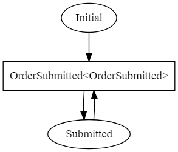
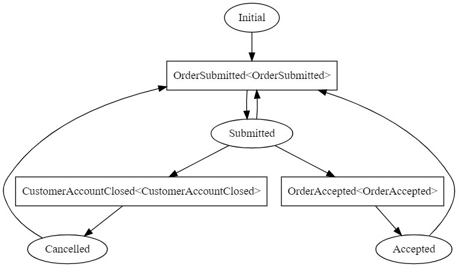

# MassTransit Sample
Projects done while learning from MassTransit's documentation and Youtube course led by MassTransit's project leader and main contributor - Chris Patterson:
https://www.youtube.com/playlist?list=PLx8uyNNs1ri2MBx6BjPum5j9_MMdIfM9C

- [MassTransit Sample](#masstransit-sample)
  * [Prerequisites](#prerequisites)
  * [Getting started](#getting-started)
  * [Solutions](#solutions)
    + [1_InMemory_Mediator](#1-inmemory-mediator)
      - [Projects to run](#projects-to-run)
    + [2_RabbitMQ_](#2-rabbitmq-)
      - [Projects to run](#projects-to-run-1)
        * [Looking up messages in RabbitMQ](#looking-up-messages-in-rabbitmq)
    + [3_StateMachine_Sagas](#3-statemachine-sagas)
      - [Projects to run](#projects-to-run-2)
        * [Looking up Sagas stored in Redis](#looking-up-sagas-stored-in-redis)
    + [4_ErrorHandling](#4-errorhandling)
      - [Projects to run](#projects-to-run-3)
        * [OrderStateMachine graph](#orderstatemachine-graph)
    + [5_StateMachine_Sagas_Advanced](#5-statemachine-sagas-advanced)
      - [Projects to run](#projects-to-run-4)
        * [OrderStateMachine graph](#orderstatemachine-graph-1)
        * [Looking up Sagas stored in MongoDB](#looking-up-sagas-stored-in-mongodb)
    + [6_RoutingSlip_Courier](#6-routingslip-courier)
      - [Projects to run](#projects-to-run-5)
        * [OrderStateMachine graph](#orderstatemachine-graph-2)

## Prerequisites
You need to have on your machine installed:
1. [.NET 6 SDK.](https://dotnet.microsoft.com/en-us/download/dotnet/6.0)
2. [Docker](https://www.docker.com/)

## Getting started
Simply choose one of the solutions specified below. They were implemented in incremental order, meaning later solutions (with higher prefix number) have more logic to them than earlier ones. 

All required dependencies are specified in 'docker-compose' file, which is unique for every solution. Simply run 

    docker-compose up

command from the path where 'docker-compose' file resides and Docker will download & run all needed dependencies for you. 

## Solutions

### 1_InMemory_Mediator
Very simple project which is using InMemory Mediator in Request-Reply pattern, to decouple logic calls from Controllers. Uses in-memory broker to exchange messages.

#### Projects to run
1. [Sample.API](MassTransit.Season1/1_InMemory_Mediator/src/Sample.API)

### 2_RabbitMQ_
New console app called 

    Sample.Service

is created, which acts as a consumer of messages coming from API. [RabbitMQ](https://www.rabbitmq.com/) dependency was introduced, as this solution uses RabbitMQ to exchange messages.

#### Projects to run
1. [Sample.API](MassTransit.Season1/2_RabbitMQ/src/Sample.API)
2. [Sample.Service](MassTransit.Season1/2_RabbitMQ/src/Sample.Service)

##### Looking up messages in RabbitMQ
Go to browser and type address [http://localhost:15672/](http://localhost:15672/). It will open RabbitMQ Management Console. By default, usr/pwd is guest/guest.

### 3_StateMachine_Sagas
In this solution, State Machine was introduced, using Automatonymous syntax. For Saga Repository, [Redis](https://redis.io/) was chosen as persistent data store.

#### Projects to run
1. [Sample.API](MassTransit.Season1/3_StateMachine_Sagas/src/Sample.API)
2. [Sample.Service](MassTransit.Season1/3_StateMachine_Sagas/src/Sample.Service)

##### Looking up Sagas stored in Redis
Open cli of redis image via Docker desktop app. Type:

    redis-cli
 
To get keys of all records stored in Redis, type:

    KEYS *

To get specific record by key use:

    get <KEY>

For example:

    get 6f21e638-4518-49c1-9460-3b64539f258c

### 4_ErrorHandling
In this solution, Unit Tests were added, along with SagaDefinition and ConsumerDefinition. These definitions allow to set up, among other things, error prevention mechanisms. Following were defined:
- Retry pattern
- In-Memory Outbox

Also, ability to generate State Machine diagram was added via UnitTest called 'GenerateStateMachineGraph' defined in [OrderStateMachineTests](MassTransit.Season1/4_ErrorHandling/src/Sample.UnitTests/StateMachines/OrderStateMachineTests.cs) class.

#### Projects to run
1. [Sample.API](MassTransit.Season1/4_ErrorHandling/src/Sample.API)
2. [Sample.Service](MassTransit.Season1/4_ErrorHandling/src/Sample.Service)

##### OrderStateMachine graph

### 5_StateMachine_Sagas_Advanced
A following business case is here handled: if Customer closes his account, his submitted Orders should be cancelled. If Customer's account is not closed, Order should be accepted.

Linq Expressions had to be used in Event's CorrelateBy method, to handle such scenario. Since [Redis](https://redis.io/) does not support using Linq Expressions like that, data store for Saga Repository has been changed from [Redis](https://redis.io/) to [MongoDB](https://www.mongodb.com/).

Also, State Machine's [Activity](https://masstransit-project.com/usage/sagas/automatonymous.html#custom) had been introduced which in general should be used whenever we need some scoped dependencies (such as database connections) in State Machine's class. Class defining State Machine should only define behaviour. Any "heavy" logic should be implemented in Activites.

#### Projects to run
1. [Sample.API](MassTransit.Season1/5_StateMachine_Sagas_Advanced/src/Sample.API)
2. [Sample.Service](MassTransit.Season1/5_StateMachine_Sagas_Advanced/src/Sample.Service)

##### OrderStateMachine graph

##### Looking up Sagas stored in MongoDB
Open cli of mongodb image via Docker desktop app. Type:

    mongo
 
To get list of all databases, type:

    show dbs

To use db created by MassTransit type the same name which was specified in MongoDbRepository() constructor, in [Program](MassTransit.Season1/5_StateMachine_Sagas_Advanced/src/Sample.Service/Program.cs) class. In this project we used name 'orderdb', so:

    use orderdb

List all collections by typing:

    show collections

In this example MassTransit created collection named 'order.states', so to list all Sagas:

    db.order.states.find()

Finding by OrderId is trickier than in Redis. In Redis, they KEY was OrderId, saved as Guid. MongoDB uses BsonId, which differs from Guid used by .NET.
The most convenient way to retrieve specific Order state by id is to use GET endpoint defined in OrderController in this case, which lets MassTransit translate BsonId and Guids.

### 6_RoutingSlip_Courier
In this project we dabble into the subject of Routing Slip using MassTransit's [Courier](https://masstransit-project.com/advanced/courier/). New console app is created called 

    Warehouse.Service

Warehouse represents completely different service / domain and should be treated as a separate Microservice, but for the sake of simplicity, we keep it in the same repo / solution, however when communication is configured, we assume it's separate service. Communication between them is done via Routing Slip (MassTransit's Courier).

Contract classes are referenced and shared between projects, as the idea is that they would be refenced via Nuget (via JFrog or something similar) anyway. Alternative would be to define same classes in every Microservice (so same ones in 'Sample' and 'Warehouse'), to completely decouple them, but this approach is not used here.

#### Projects to run
1. [Sample.API](MassTransit.Season1/6_RoutingSlip_Courier/src/Sample.API)
2. [Sample.Service](MassTransit.Season1/6_RoutingSlip_Courier/src/Sample.Service)
3. [Warehouse.Service](MassTransit.Season1/6_RoutingSlip_Courier/src/Warehouse/Warehouse.Service)

##### OrderStateMachine graph
